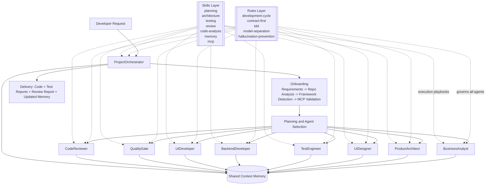
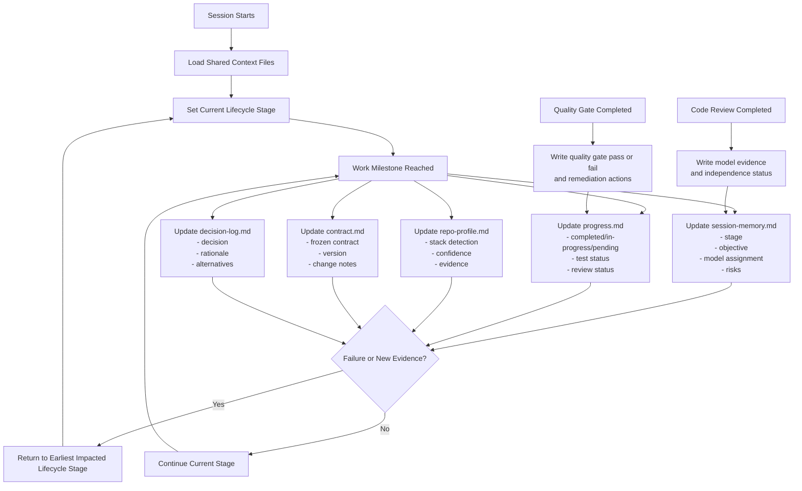
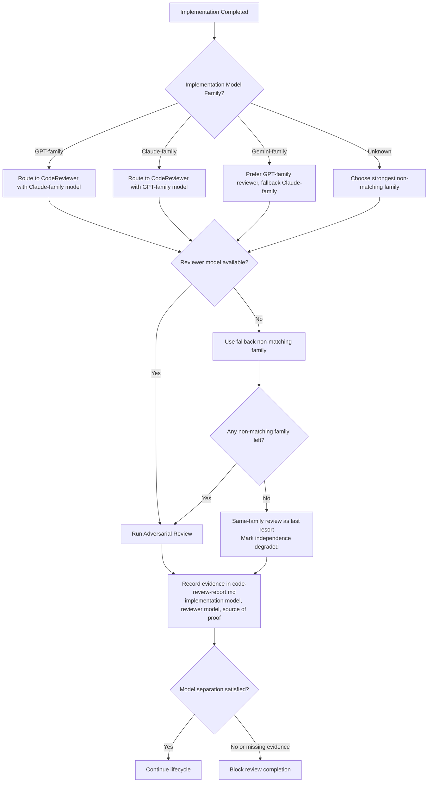

# Copilot Agent Architecture

This repository defines a modular, deterministic, MCP-first multi-agent workflow for software delivery.

## Design Goals

- Orchestrator-first execution and lifecycle governance
- Reusable rules and skills with minimal duplication
- Contract-first delivery for multi-component changes
- Shared memory as session source of truth
- Model-aware review independence for stronger quality control
- Low-hallucination behavior through inspect-first and MCP-first practices

## Repository Layout

```text
.github/
   copilot-instructions.md
   agents/
      ProjectOrchestrator.agent.md
      BusinessAnalyst.agent.md
      ProductArchitect.agent.md
      UI-Designer.agent.md
      TestEngineer.agent.md
      BackendDeveloper.agent.md
      UI-Developer.agent.md
      QualityGate.agent.md
      CodeReviewer.agent.md
   rules/
      development-cycle.md
      hallucination-prevention.md
      coding-standards.md
      context-management.md
      tdd.md
      contract-first.md
      model-separation.md
   skills/
      framework-detection/SKILL.md
      mcp/SKILL.md
      planning/SKILL.md
      memory/SKILL.md
      architecture/SKILL.md
      code-analysis/SKILL.md
      documentation/SKILL.md
      testing/SKILL.md
      quality-gate/SKILL.md
      debugging/SKILL.md
      review/SKILL.md
      figma/SKILL.md
      agent-selection/SKILL.md
   context/
      session-memory.md
      repo-profile.md
      contract.md
      decision-log.md
      progress.md
docs/
   diagrams/
      architecture-flow.mmd
      lifecycle-flow.mmd
      memory-management-flow.mmd
```

## System Flow

Source file: [.github/docs/diagrams/architecture-flow.mmd](.github/docs/diagrams/architecture-flow.mmd)



## Enforced Lifecycle

Source file: [.github/docs/diagrams/lifecycle-flow.mmd](.github/docs/diagrams/lifecycle-flow.mmd)

```mermaid
flowchart LR
      S1[1 Prompt] --> S2[2 Requirements Analysis]
      S2 --> S3[3 Repository Analysis]
      S3 --> S4[4 Framework Detection]
      S4 --> S5[5 MCP Validation]
      S5 --> S6[6 Architecture Analysis]
      S6 --> S7[7 Contract Design if needed]
      S7 --> S8[8 Developer Approval]
      S8 --> S9[9 Planning]
      S9 --> S10[10 TDD or Test Plan]
      S10 --> S11[11 Implementation]
      S11 --> S12[12 Integration Testing]
      S12 --> S13[13 Quality Gate]
      S13 --> S14[14 Code Review]
      S14 --> S15[15 Refactoring]
      S15 --> S16[16 Documentation Update]
      S16 --> S17[17 Validation]
      S17 --> S18[18 Completion]

      S14 --> G1{Model Separation\nSatisfied?}
      G1 -->|No| S9
      G1 -->|Yes| S15

      S13 --> G4{Quality Gate Passed?}
      G4 -->|No| S9
      G4 -->|Yes| S14

      S7 --> G2{Contract Approved?}
      G2 -->|No| S6
      G2 -->|Yes| S8

      S10 --> G3{Tests Failing First?}
      G3 -->|No| S9
      G3 -->|Yes| S11
```



## Memory Management

Source file: [.github/docs/diagrams/memory-management-flow.mmd](.github/docs/diagrams/memory-management-flow.mmd)



### Shared Memory Files and Their Roles

- `.github/context/session-memory.md`
   - lifecycle stage, objective owner, model assignment, active risks
- `.github/context/progress.md`
   - completed/in-progress/pending work, test status, review status
- `.github/context/repo-profile.md`
   - detected stack, confidence level, evidence for detection decisions
- `.github/context/contract.md`
   - frozen contract and change log for frontend/backend synchronization
- `.github/context/decision-log.md`
   - decisions, rationale, alternatives, and impacted files

## Rules vs Skills vs Agents

- Agents
   - operational roles that execute work
- Rules
   - non-negotiable governance constraints (lifecycle, TDD, contract-first, quality gate, model separation)
- Skills
   - procedural playbooks (planning, architecture, testing, quality gate, review, memory discipline)

In practice, the active agent applies its referenced rules and skills while executing tasks and updating memory.

## Model-Aware Control

- Each agent can define default model preferences in frontmatter.
- Handoffs can pin a model for stage transitions.
- Code review must satisfy model-independence requirements from `.github/rules/model-separation.md`.

### Safe Gemini Enablement Checklist

1. Confirm Gemini models are available in your Copilot model picker/catalog.
2. Copy the exact Gemini display string when adding to an agent `model` array.
3. Keep existing fallback entries so unsupported environments still work.
4. Preserve cross-family review routing:
   - GPT implementation -> Claude review
   - Claude implementation -> GPT review
   - Gemini implementation -> GPT review first, then Claude fallback
5. Validate that review evidence fields are still populated in `.github/project-notes/code-review-report.md`.

### Model Routing Flow

Source file: [.github/docs/diagrams/model-routing-flow.mmd](.github/docs/diagrams/model-routing-flow.mmd)



## MCP-First Behavior

- Onboarding checks for `.vscode/mcp.json`.
- Official MCP documentation/code samples are preferred over model memory.
- If MCP setup is missing, developer choice (create or skip) is required before proceeding.
